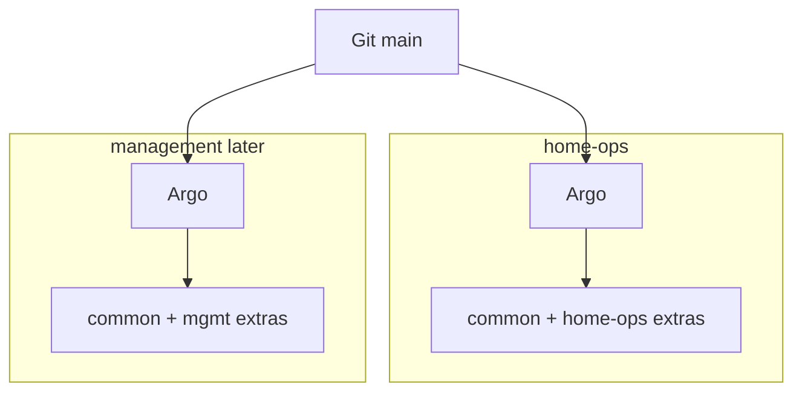

# home-ops

Talos + Omni bootstrap and Argo CD GitOps for `home-ops` and (scaffold) `management`.

## Workflow

- Work on a branch and open a PR; **do not push straight to `main`**.
- CI (`kubeconform` + Omni template validate) must stay green before merge.
- Argo on each cluster syncs from `main` after merge.

## Layout

```text
kubernetes/
  bootstrap/                 Omni templates + root apps Applications
  argo/
    common/                  Shared Argo Applications (platform)
    clusters/home-ops/       home-ops extras (e.g. Longhorn) + kustomize
    clusters/mgmt/           management extras (none yet) + kustomize
  apps/                      Helm values and extra manifests
  versions.env               Shared chart/CRD pins for Omni bootstrap render
```

Each cluster runs **its own Argo CD** (no hub/spoke). Shared apps live in `argo/common/`; per-cluster workloads live under `argo/clusters/<name>/`.



## Prerequisites

- [mise](https://mise.jdx.dev/) (`mise install` from [`.mise.toml`](.mise.toml))
- [1Password CLI](https://developer.1password.com/docs/cli/) signed in (`op`) when running Omni tasks — `mise run omni-*` / `mise run omnictl` load the **Cursor** service account from vault `k8s-secrets` (item `Omni Cursor service account`) via [`scripts/with-omni-sa.sh`](scripts/with-omni-sa.sh) (other mise commands do not prompt)
- Local-only files (gitignored): `kubeconfig`, `kubeconfig-headlamp-desktop`, `talosconfig`, `HWIDs.md` (`omniconfig` is optional for personal UI/cli outside mise)

## Bootstrap (home-ops)

```bash
mise run omni-sync       # render manifests, sync Omni template, merge kube/talos contexts
mise run omni-bootstrap  # wait for nodes, seed 1Password token, apply root apps Application
```

Omni installs Gateway API CRDs, Cilium, CoreDNS, Spegel, and Argo CD once (`mode: one-time`). Day-2 is owned by Argo from `kubernetes/argo/clusters/home-ops`.

Root Application: [`kubernetes/bootstrap/argo-apps.yaml`](kubernetes/bootstrap/argo-apps.yaml).

Chart/CRD versions for bootstrap: [`kubernetes/versions.env`](kubernetes/versions.env). Keep Argo Application `targetRevision` values aligned when merging Renovate bumps.

### kubectl / talosctl contexts

Sync tasks **merge** contexts into the shared `kubeconfig` and `talosconfig` files:

| Context | Cluster |
|---------|---------|
| `home-ops` (default) | home-ops |
| `management` | management (after `omni-mgmt-sync`) |

After any sync, the default kubectl/talos context is reset to **home-ops**.

## Management cluster (scaffold)

```bash
mise run omni-mgmt-validate
mise run omni-mgmt-sync    # merges management contexts; keeps home-ops as default
# mise run omni-mgmt-reset
```

Full mgmt bootstrap and testing still need Omni machine wiring later. When ready, apply [`kubernetes/bootstrap/argo-apps-mgmt.yaml`](kubernetes/bootstrap/argo-apps-mgmt.yaml) on that cluster’s Argo.

## Ingress and TLS

| Item | Value |
|------|--------|
| Public domain | `home-ops.nl` |
| Kubernetes API VIP (Talos L2) | `10.0.8.6` (`eno1.8`; do not use as `talosconfig` endpoint) |
| External Gateway VIP (LAN) | `10.0.8.120` |
| Internal Gateway VIP | `10.0.8.110` |
| Internet ingress | Cloudflare Tunnel (`cloudflared` in `cloudflare-tunnel`) → ClusterIP Services |
| Example hosts | `authentik.home-ops.nl`, `argocd.home-ops.nl`, `longhorn.home-ops.nl`, `grafana.home-ops.nl`, `hubble.home-ops.nl`, `headlamp.home-ops.nl` |

**Internet:** Cloudflare Tunnel (token from 1Password item `cloudflare-tunnel` / `TUNNEL_TOKEN`). Public DNS is a **proxied CNAME** to `<TUNNEL_ID>.cfargotunnel.com` (not an A record to the WAN IP or `10.0.8.120`). Hostname → Service origins and DNS are owned by git [`ingress.yaml`](kubernetes/apps/cloudflare-tunnel/ingress.yaml) and applied by an Argo PostSync Job (see [`HOSTNAMES.md`](kubernetes/apps/cloudflare-tunnel/HOSTNAMES.md)). Dashboard edits are overwritten on sync.

**LAN:** Cilium Gateway VIP `10.0.8.120` with HTTPRoutes (optional split-horizon / hosts → VIP for low latency).

**TLS:**

- **Internet:** Cloudflare terminates visitor HTTPS; origins are HTTP to in-cluster Services.
- **LAN Gateway:** Let's Encrypt **production** via DNS-01 (Cloudflare API): ClusterIssuer `letsencrypt-production`; Certificate `home-ops-nl` → secret `home-ops-nl-tls` (`home-ops.nl`, `*.home-ops.nl`).

**Gateway exposure (LAN):** the external Gateway `http` listener only allows routes from `kube-system` (`from: Same`). The **https** listener allows routes from **all** namespaces (`from: All`). Prefer HTTPS HTTPRoutes for LAN UIs.

### Authentication (default deny)

Public HTTPS UIs are protected by **Authentik** unless a route is explicitly documented as an exception.

| Host | Protection |
|------|------------|
| `authentik.home-ops.nl` | Public IdP (login / OIDC / outpost callbacks) |
| `argocd.home-ops.nl` | Native OIDC → Authentik (local admin disabled) |
| `grafana.home-ops.nl` | Native OIDC → Authentik (login form / basic auth disabled) |
| `hubble.home-ops.nl` | Authentik **proxy** outpost → Hubble UI |
| `longhorn.home-ops.nl` | Authentik **proxy** outpost → Longhorn UI |
| `headlamp.home-ops.nl` | Authentik **proxy** outpost → Headlamp (pod SA → API; shared `cluster-admin`) |

**Desktop Headlamp:** mint a local kubeconfig for the `headlamp-desktop` SA (`cluster-admin`) with `mise run headlamp-desktop-kubeconfig` (writes gitignored `kubeconfig-headlamp-desktop`). Point the desktop app at that file. The file talks to the Talos L2 Kubernetes API VIP (`https://10.0.8.6:6443` by default; override with `HEADLAMP_DESKTOP_SERVER`) because the Omni proxy does not accept Kubernetes SA tokens.

**Add a new public UI:** prefer app-native OIDC against Authentik; if the app has no SSO, put an Authentik proxy provider in [`kubernetes/apps/authentik/blueprints.yaml`](kubernetes/apps/authentik/blueprints.yaml), attach it to the embedded outpost, and point the HTTPRoute at `authentik-server` in `authentik` (see Hubble/Longhorn + ReferenceGrant). Do **not** publish an unprotected HTTPRoute on the external Gateway.

**1Password:** create item `authentik` in vault `k8s-secrets` with fields `SECRET_KEY`, `POSTGRES_PASSWORD`, `BOOTSTRAP_PASSWORD`, `BOOTSTRAP_EMAIL`, `ARGOCD_CLIENT_SECRET`, `GRAFANA_CLIENT_SECRET`. `POSTGRES_PASSWORD` is the Authentik DB role on the shared CNPG cluster. Item `cloudflare-tunnel` needs `TUNNEL_TOKEN`, `TUNNEL_ID`, `ACCOUNT_ID`, and `ZONE_ID`. Tunnel config/DNS apply reuses item `cloudflare` / `CLOUDFLARE_DNS_TOKEN` (same as cert-manager; scopes: Zone DNS Edit + Account Cloudflare Tunnel Edit). ExternalSecrets sync these into the cluster. OIDC client IDs are fixed (`argocd`, `grafana`). Local apply: `mise run cloudflare-tunnel-apply`.

**Bootstrap admin:** log in once at `https://authentik.home-ops.nl` with `akadmin` / `BOOTSTRAP_PASSWORD`, then add your user to groups `ArgoCD Admins`, `Grafana Admins`, and/or `Home Ops Users`.

**Break-glass (local admin):**

- Argo CD: set `configs.cm.admin.enabled: "true"` in [`kubernetes/apps/argo-system/values.yaml`](kubernetes/apps/argo-system/values.yaml), sync, then `argocd admin initial-password -n argo-system` (or the initial admin secret).
- Grafana: set `auth.disable_login_form: false` and `auth.basic.enabled: true` in kube-prometheus-stack values, sync, use the chart admin secret.

### Shared PostgreSQL (CloudNativePG)

home-ops runs one CNPG cluster `postgres` in namespace `database` (Longhorn PVC, single instance). Apps get their own role + database:

| App | Role / DB | Connect |
|-----|-----------|---------|
| Authentik | `authentik` | `postgres-rw.database.svc.cluster.local:5432` |

**Add another app DB** (e.g. Home Assistant recorder): add `DatabaseRole` + `Database` under [`kubernetes/apps/database/`](kubernetes/apps/database/), password via ExternalSecret (`kubernetes.io/basic-auth` with `cnpg.io/reload: "true"`), point the app at `postgres-rw.database.svc.cluster.local`.

### Longhorn PVC backups (NFS)

home-ops backs up Longhorn volumes to NAS **`datadoos.im25.nl:/mnt/ssd_z2/kubernetes/home-ops`** (dedicated folder on the `kubernetes` NFS export) via Longhorn’s default backup target. A daily RecurringJob (`backup-daily`, 03:00 UTC, retain **14**) covers volumes in the `default` group.

Runbook (create / restore / retention): [`kubernetes/apps/longhorn-system/BACKUPS.md`](kubernetes/apps/longhorn-system/BACKUPS.md).

**Do not** apply NAS-side retention on that folder. Postgres on CNPG is only crash-consistent via PVC backup; prefer CNPG object-store backups for DB recovery later.

### Cert bootstrap order

1. External Secrets (`sync-wave: -2`) + `1password-token`
2. cert-manager chart (`-1`)
3. Cloudflare ExternalSecret then ClusterIssuer (`cert-manager-config` wave `0`, issuer resource wave `1`)
4. Gateway Certificate → HTTPS routes (LAN)
5. CloudNativePG operator (`0`) → shared `postgres` cluster (`1`) → Authentik (`2`) then app OIDC / proxy routes
6. Cloudflare Tunnel (`3`) after External Secrets has `TUNNEL_TOKEN`

## SecureBoot / TPM

home-ops runs **SecureBoot UKIs** with **TPM LUKS** on STATE, EPHEMERAL, and `u-longhorn` (`tpm.options.pcrs: []` = PCR 11 only). Omni picks the SecureBoot installer from machine `secureBoot: true` — there is no template flag.

Ops reference (media preset, upgrades, re-provision, recovery): [`kubernetes/bootstrap/talos/SECUREBOOT-TPM.md`](kubernetes/bootstrap/talos/SECUREBOOT-TPM.md).

## Observability

home-ops runs a light metrics + logs + Hubble stack (home-ops only, under `argo/clusters/home-ops`):

| Piece | Notes |
|-------|--------|
| metrics-server | `kubectl top`; Talos needs `--kubelet-insecure-tls` |
| kube-prometheus-stack | Prometheus + Grafana + Alertmanager; **7d** retention; PVC on Longhorn |
| Loki + Alloy | Pod logs → Loki (14d retention in Loki limits); Grafana datasource via sidecar ConfigMap |
| Hubble | Cilium flows + metrics + UI |

| UI | URL |
|----|-----|
| Grafana | https://grafana.home-ops.nl (Authentik OIDC) |
| Hubble UI | https://hubble.home-ops.nl (Authentik proxy) |

Grafana uses Authentik SSO (local login disabled). See [Authentication (default deny)](#authentication-default-deny) for break-glass.

To scrape a new app, add a `ServiceMonitor`/`PodMonitor` in the app namespace (or under [`kubernetes/apps/monitoring/`](kubernetes/apps/monitoring/)); Prometheus is configured with empty selectors so it picks up cluster-wide monitors. Spegel ServiceMonitor is enabled in chart values (needs Prometheus Operator CRDs — Spegel Application uses `SkipDryRunOnMissingResource`).

Talos etcd / controller-manager / scheduler / kube-proxy scrapes are **disabled** in kube-prometheus-stack values (not reachable like kubeadm).

