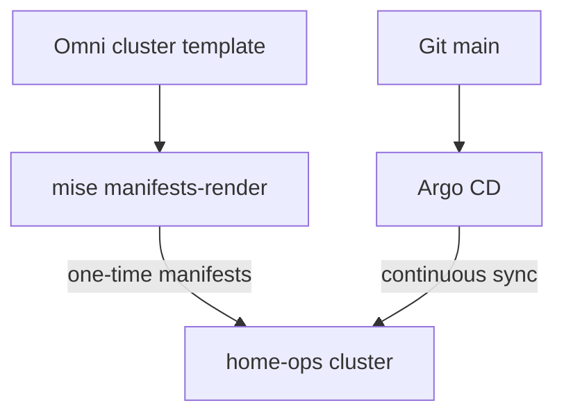

# home-ops

Talos + Omni bootstrap and Argo CD GitOps for the `home-ops` cluster.

## Layout

```text
kubernetes/
  bootstrap/     Omni cluster templates + one-time bootstrap manifests
  argo/apps/     Argo CD Applications (app-of-apps)
  apps/          Helm values and extra manifests synced by those Applications
  versions.env   Shared chart/CRD pins for Omni bootstrap render
```



## Prerequisites

- [mise](https://mise.jdx.dev/) (`mise install` from [`.mise.toml`](.mise.toml))
- Omni access via local [`omniconfig`](omniconfig) (gitignored kubeconfig/talosconfig are written by sync tasks)

## Bootstrap

```bash
mise run omni-sync       # render manifests, sync Omni template, refresh kubeconfig/talosconfig
mise run omni-bootstrap  # wait for nodes, seed 1Password token for ESO, apply root apps Application
```

Omni installs Gateway API CRDs, Cilium, CoreDNS, Spegel, and Argo CD once (`mode: one-time`). After that, Argo owns day-2 upgrades from `kubernetes/argo/apps/`.

Chart/CRD versions for bootstrap live in [`kubernetes/versions.env`](kubernetes/versions.env). Keep matching Argo Application `targetRevision` values when merging Renovate bumps.

## Ingress and TLS

| Item | Value |
|------|--------|
| Public domain | `home-ops.nl` |
| External Gateway VIP | `10.0.8.120` |
| Internal Gateway VIP | `10.0.8.110` |
| Example hosts | `argocd.home-ops.nl`, `longhorn.home-ops.nl` |

**TLS uses Let's Encrypt staging on purpose** while the lab is under active change:

- ClusterIssuer: `letsencrypt-staging`
- Certificate / secret: `home-ops-nl-staging` → `home-ops-nl-staging-tls`
- Browsers will show a trust warning (staging CA). That is expected.
- Production issuer stays commented in [`kubernetes/apps/cert-manager/clusterissuer.yaml`](kubernetes/apps/cert-manager/clusterissuer.yaml) until a deliberate cutover.

Point Cloudflare DNS for `*.home-ops.nl` (and apex if needed) at `10.0.8.120`. Only the Gateway **https** listener accepts routes from all namespaces; **http** is limited to `kube-system`.

## Day-2 apps

Root Application: [`kubernetes/bootstrap/argo-apps.yaml`](kubernetes/bootstrap/argo-apps.yaml) (recurse over `kubernetes/argo/apps`).

Secrets: External Secrets Operator + 1Password (`ClusterSecretStore` `1password`). Bootstrap creates the `1password-token` Secret via `mise run omni-1password-bootstrap`.

## Related clusters

[`kubernetes/bootstrap/talos/omni-mgmt.yaml`](kubernetes/bootstrap/talos/omni-mgmt.yaml) defines a management cluster template; mise tasks currently target **home-ops** only.
