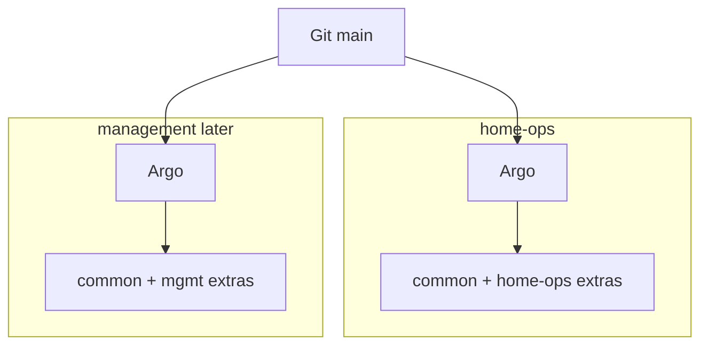

# home-ops

Talos + Omni bootstrap and Argo CD GitOps for `home-ops` and (scaffold) `management`.

## Workflow

- Work on a branch and open a PR; **do not push straight to `main`**.
- CI (`kubeconform` + Omni template validate) must stay green before merge.
- Argo on each cluster syncs from `main` after merge.

## Layout

```text
kubernetes/
  bootstrap/                 Omni templates + root apps Applications
  argo/
    common/                  Shared Argo Applications (platform)
    clusters/home-ops/       home-ops extras (e.g. Longhorn) + kustomize
    clusters/mgmt/           management extras (none yet) + kustomize
  apps/                      Helm values and extra manifests
  versions.env               Shared chart/CRD pins for Omni bootstrap render
```

Each cluster runs **its own Argo CD** (no hub/spoke). Shared apps live in `argo/common/`; per-cluster workloads live under `argo/clusters/<name>/`.



## Prerequisites

- [mise](https://mise.jdx.dev/) (`mise install` from [`.mise.toml`](.mise.toml))
- [1Password CLI](https://developer.1password.com/docs/cli/) signed in (`op`) — mise loads the Omni **Cursor** service account from vault `k8s-secrets` (item `Omni Cursor service account`) and sets `OMNI_ENDPOINT` / `OMNI_SERVICE_ACCOUNT_KEY` (see [`scripts/omni-sa-env.sh`](scripts/omni-sa-env.sh))
- Local-only files (gitignored): `kubeconfig`, `talosconfig`, `HWIDs.md` (`omniconfig` is optional for personal UI/cli outside mise)

## Bootstrap (home-ops)

```bash
mise run omni-sync       # render manifests, sync Omni template, merge kube/talos contexts
mise run omni-bootstrap  # wait for nodes, seed 1Password token, apply root apps Application
```

Omni installs Gateway API CRDs, Cilium, CoreDNS, Spegel, and Argo CD once (`mode: one-time`). Day-2 is owned by Argo from `kubernetes/argo/clusters/home-ops`.

Root Application: [`kubernetes/bootstrap/argo-apps.yaml`](kubernetes/bootstrap/argo-apps.yaml).

Chart/CRD versions for bootstrap: [`kubernetes/versions.env`](kubernetes/versions.env). Keep Argo Application `targetRevision` values aligned when merging Renovate bumps.

### kubectl / talosctl contexts

Sync tasks **merge** contexts into the shared `kubeconfig` and `talosconfig` files:

| Context | Cluster |
|---------|---------|
| `home-ops` (default) | home-ops |
| `management` | management (after `omni-mgmt-sync`) |

After any sync, the default kubectl/talos context is reset to **home-ops**.

## Management cluster (scaffold)

```bash
mise run omni-mgmt-validate
mise run omni-mgmt-sync    # merges management contexts; keeps home-ops as default
# mise run omni-mgmt-reset
```

Full mgmt bootstrap and testing still need Omni machine wiring later. When ready, apply [`kubernetes/bootstrap/argo-apps-mgmt.yaml`](kubernetes/bootstrap/argo-apps-mgmt.yaml) on that cluster’s Argo.

## Ingress and TLS

| Item | Value |
|------|--------|
| Public domain | `home-ops.nl` |
| External Gateway VIP | `10.0.8.120` |
| Internal Gateway VIP | `10.0.8.110` |
| Example hosts | `argocd.home-ops.nl`, `longhorn.home-ops.nl` |

**TLS uses Let's Encrypt staging on purpose** while the lab is under active change:

- ClusterIssuer: `letsencrypt-staging`
- Certificate / secret: `home-ops-nl-staging` → `home-ops-nl-staging-tls`
- Browsers will show a trust warning (staging CA). That is expected.
- Production issuer stays commented until a deliberate cutover.

Point Cloudflare DNS for `*.home-ops.nl` at `10.0.8.120`. Only the Gateway **https** listener accepts routes from all namespaces.

### Cert bootstrap order

1. External Secrets (`sync-wave: -2`) + `1password-token`
2. cert-manager chart (`-1`)
3. Cloudflare ExternalSecret then ClusterIssuer (`cert-manager-config` wave `0`, issuer resource wave `1`)
4. Gateway Certificate → HTTPS routes

## SecureBoot / TPM

home-ops runs **SecureBoot UKIs** with **TPM LUKS** on STATE, EPHEMERAL, and `u-longhorn` (`tpm.options.pcrs: []` = PCR 11 only). Omni picks the SecureBoot installer from machine `secureBoot: true` — there is no template flag.

Ops reference (media preset, upgrades, re-provision, recovery): [`kubernetes/bootstrap/talos/SECUREBOOT-TPM.md`](kubernetes/bootstrap/talos/SECUREBOOT-TPM.md).
